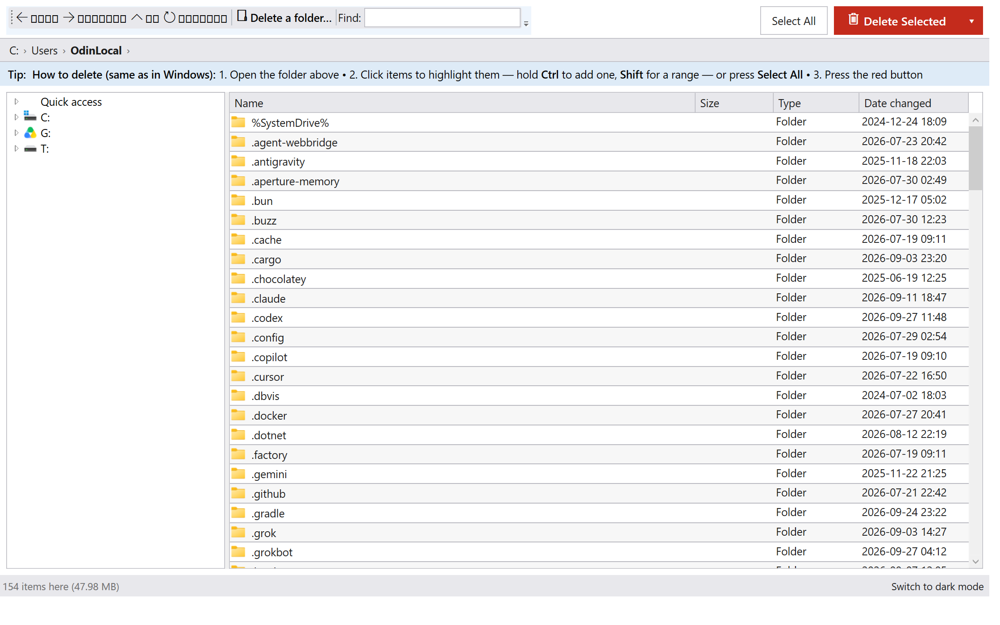

# FastDelete

**Fast, safe, easy deletion of huge file selections on Windows — built for everyone, not just power users.**

FastDelete is a polished Windows file manager built around one job: deleting very large
selections (100,000+ files) as fast as your storage allows, while staying as easy to use
as Windows Explorer.


## Highlights

- **Works like Windows Explorer** — click to select, Ctrl+click to add, Shift+click for a
  range, Ctrl+A or the **Select All** button for everything. Right-click menu included.
- **One big red "Delete Selected (N)" button** — the count is always visible before
  anything disappears.
- **"Delete a folder…" picker** — the familiar Windows folder picker opens straight into
  any folder; no tree navigation needed.
- **Permanent deletion engine**: single-pass `FindFirstFileEx` walker feeding a parallel
  deleter (`NtSetInformationFile(FileDispositionInformationEx)` fast path with classic
  `DeleteFile` fallback). Measured **~5,000 items/s** vs Explorer's ~1,000 on the same tree.
- **Safe**: reparse points (junctions/symlinks) are unlinked, never followed; long-path
  aware; read-only files deleted without attribute-clearing detours; per-file failure
  report with Retry / Copy / Export CSV.
- **"Move to Recycle Bin"** option (chunked `SHFileOperation`).
- **Pause / resume / cancel** during deletion, with plain-language progress.
- **Light theme by default**, dark mode one click away; large readable text; coaching
  banner that teaches the 3-step flow and disappears once you select something.

## Screenshots



## Download

Grab `FastDelete-v0.5.1-win-x64.zip` from the
[Releases page](https://github.com/berkkarabacak/FastDelete/releases) — no installation
needed, works on Windows 10/11 x64. Start `FastDelete.exe` (or drag a folder onto
`FastDelete.cmd`).

## Usage

```
FastDelete.exe [folder]     open directly in that folder
```

## Development

```bat
bash dn.sh build FastDelete.sln    build everything
bash dn.sh test                    48 xUnit tests (junction, TOCTOU, locked files,
                                   long paths, 20k-item channel-backpressure regression, 100k scale)
bash dn.sh run --project src/FastDelete.Benchmarks -- --profiles tiny10k,tiny100k,deep1k,mixed --workers 1,2,4,8
```

## Repository layout

| Path | What |
|---|---|
| `src/FastDelete.Core` | deletion engine library (Win32/NT interop, walker, strategies) |
| `src/FastDelete.App` | the WPF GUI |
| `src/FastDelete.Benchmarks` | throughput harness |
| `tests/FastDelete.Core.Tests` | 18 xUnit tests |
| `tests/FastDelete.TestData` | deterministic tree generator |
| `tools/make_icon.py` | regenerates the app icon |

## Measured (docs/benchmarks.md)

~2.2 s for 10,100 tiny files vs 5.6 s for PowerShell `Remove-Item` and 10.2 s for the
Explorer delete verb (Recycle Bin) on the same machine.
